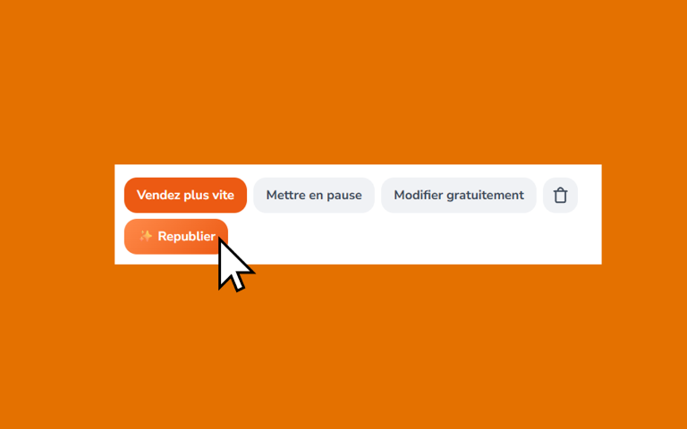

# 🔄 LBC ReLister

**[English](README.md) | Français**

Une extension Chrome pour republier rapidement vos annonces sur leboncoin.fr.

## 🚀 Installation

1. Clonez ce dépôt ou téléchargez-le en tant que ZIP
2. Ouvrez Chrome et allez sur `chrome://extensions`
3. Activez le "Mode développeur" en haut à droite
4. Cliquez sur "Charger l'extension non empaquetée" et sélectionnez le dossier de l'extension
5. Rendez-vous sur votre [tableau de bord Leboncoin](https://www.leboncoin.fr/compte/part/mes-annonces)

## 📖 Utilisation

1. Rendez-vous sur votre [tableau de bord Leboncoin](https://www.leboncoin.fr/compte/part/mes-annonces)
2. Cliquez sur le bouton **✨ Republier** à côté de n'importe quelle annonce
3. Modifiez le prix si nécessaire (ou conservez le prix actuel)
4. Confirmez l'action
5. Attendez que le processus de republication automatique se termine

L'extension va :
- ✅ Supprimer votre ancienne annonce
- ✅ Créer une nouvelle annonce avec le même contenu
- ✅ Mettre à jour le prix si vous l'avez modifié
- ✅ Actualiser le tableau de bord pour afficher la nouvelle annonce

## 📝 Licence

Licence MIT - Libre d'utilisation et de modification

## ☕ Soutien

Si vous trouvez cette extension utile, pensez à soutenir le projet :
- ⭐ Mettez une étoile à ce dépôt
- 🐛 Signalez des bugs
- 💡 Suggérez des fonctionnalités
- ☕ [Offrez-moi un café](https://buymeacoffee.com/valcolncw)

## ⚠️ Avertissement

Cette extension n'est pas affiliée à Leboncoin et n'est pas approuvée par Leboncoin. Utilisez-la à vos propres risques. Respectez toujours les Conditions d'Utilisation de Leboncoin.

---

**Fait avec ❤️ pour les utilisateurs de Leboncoin**

